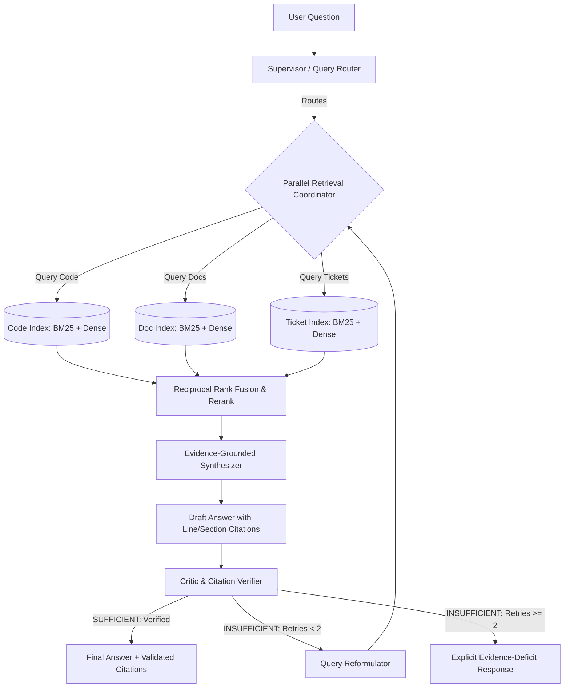

# RepoLens

> **RepoLens**: A self-correcting, multi-agent knowledge & citation engine that answers complex multi-hop engineering questions across source code, documentation, and tickets. Built with AST-level code tracing, hybrid retrieval, and deterministic citation verification.

---

## 1. Project Overview
**RepoLens** is an enterprise-grade AI system designed to solve the fragmented knowledge problem in software organizations. Instead of generating unverified answers from raw LLM memory, it acts as a deterministic verification gate across:
- **Source Code**: AST-aware semantic parsing with parent class context and exact line bounds.
- **Documentation**: Hierarchical markdown sections with heading breadcrumbs.
- **Engineering Tickets**: Issue tracking data with comments, linked commits, and status history.

---

## 2. Problem Statement
Developers spend up to 30% of their time navigating disconnected repositories, stale documentation, and closed GitHub issues/Jira tickets to understand *why* systems behave the way they do. Traditional keyword searches lack semantic synthesis, while naive RAG pipelines suffer from:
1. Routing failures (searching docs when the answer is only in code).
2. AST context truncation (cutting methods in half with fixed-size chunks).
3. Ungrounded hallucinations (inventing parameters, symbols, or ticket IDs).
4. Zero citation traceability (claims without line-accurate provenance).

---

## 3. Architecture



---

## 4. Engineering Principles
1. **No Technology Without Justification**: Every dependency exists to solve an architectural constraint.
2. **Measure Before & After Complexity**: Baseline established first; every addition must demonstrate an empirical delta.
3. **Deterministic Verification**: Unverified citations and hallucinated references are rejected before reaching the user.
4. **Bounded Agent Loops**: `MAX_RETRIES = 2` prevents runaway latency, token bloat, and infinite cycles.
5. **No Fabricated Metrics**: Unmeasured experiments are marked as *Not measured yet*.

---

## 5. Project Structure
```text
engineering-knowledge-copilot/
├── docs/                      # Architectural specs, ADRs, problem definitions
│   ├── problem-definition.md
│   ├── architecture.md
│   ├── requirements.md
│   ├── evaluation-plan.md
│   ├── engineering-decisions.md
│   └── failure-analysis-log.md
├── src/                       # Production source code
│   ├── core/                  # Data models, config, abstract protocols
│   ├── ingestion/             # Repository loader, AST chunker, doc/ticket parsers
│   ├── retrieval/             # BM25, vector search, RRF fusion, reranker
│   ├── agents/                # Router, Synthesizer, Critic, LangGraph state machine
│   ├── evaluation/            # Metrics harness, citation validator, benchmark runner
│   └── api/                   # FastAPI service & schemas
├── tests/                     # Test suite
│   ├── unit/                  # Fast deterministic unit tests (parsers, chunkers)
│   ├── integration/           # Graph flow & pipeline tests
│   └── evaluation/            # Automated regression checks
├── eval/                      # Evaluation assets
│   ├── data/                  # 40-50 curated benchmark questions & ground truth
│   ├── benchmarks/            # Benchmark execution scripts
│   └── reports/               # Ablation tables & experiment runs
├── prompts/                   # Versioned prompt artifacts
│   ├── router/
│   ├── synthesis/
│   └── critic/
├── pyproject.toml             # Pinned dependencies and tool configuration
└── README.md
```

---

## 6. Baseline vs. Ablation Progress

| System Variant | Recall@5 | Precision@5 | Faithfulness | Citation Validity | Routing Acc. | P95 Latency | Est. Cost / 1k |
|---|---|---|---|---|---|---|---|
| **System A (Naive RAG)** | *Not measured yet* | *Not measured yet* | *Not measured yet* | *Not measured yet* | N/A | *Not measured yet* | *Not measured yet* |
| **System B (Hybrid Search)** | *Not measured yet* | *Not measured yet* | *Not measured yet* | *Not measured yet* | N/A | *Not measured yet* | *Not measured yet* |
| **System C (+ Router)** | *Not measured yet* | *Not measured yet* | *Not measured yet* | *Not measured yet* | *Not measured yet* | *Not measured yet* | *Not measured yet* |
| **System D (+ Critic)** | *Not measured yet* | *Not measured yet* | *Not measured yet* | *Not measured yet* | *Not measured yet* | *Not measured yet* | *Not measured yet* |
| **System E (+ Bounded Retry)**| *Not measured yet* | *Not measured yet* | *Not measured yet* | *Not measured yet* | *Not measured yet* | *Not measured yet* | *Not measured yet* |

