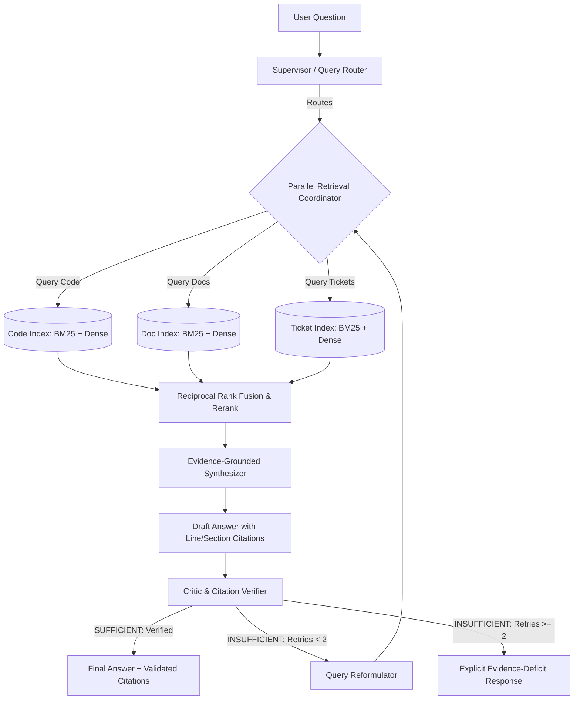

# RepoLens

> **RepoLens**: A self-correcting, multi-agent knowledge & citation engine that answers complex multi-hop engineering questions across source code, documentation, and tickets. Built with AST-level code tracing, hybrid retrieval, and deterministic citation verification.

---

## 1. Project Overview
**RepoLens** is an enterprise-grade AI system designed to solve the fragmented knowledge problem in software organizations. Instead of generating unverified answers from raw LLM memory, it acts as a deterministic verification gate across:
- **Source Code**: AST-aware semantic parsing with parent class context and exact line bounds.
- **Documentation**: Hierarchical markdown sections with heading breadcrumbs.
- **Engineering Tickets**: Issue tracking data with comments, linked commits, and status history.

---

## 2. Problem Statement
Developers spend up to 30% of their time navigating disconnected repositories, stale documentation, and closed GitHub issues/Jira tickets to understand *why* systems behave the way they do. Traditional keyword searches lack semantic synthesis, while naive RAG pipelines suffer from:
1. Routing failures (searching docs when the answer is only in code).
2. AST context truncation (cutting methods in half with fixed-size chunks).
3. Ungrounded hallucinations (inventing parameters, symbols, or ticket IDs).
4. Zero citation traceability (claims without line-accurate provenance).

---

## 3. Architecture



---

## 4. Engineering Principles
1. **No Technology Without Justification**: Every dependency exists to solve an architectural constraint.
2. **Measure Before & After Complexity**: Baseline established first; every addition must demonstrate an empirical delta.
3. **Deterministic Verification**: Unverified citations and hallucinated references are rejected before reaching the user.
4. **Bounded Agent Loops**: `MAX_RETRIES = 2` prevents runaway latency, token bloat, and infinite cycles.
5. **No Fabricated Metrics**: Unmeasured experiments are marked as *Not measured yet*.

---

## 5. Project Structure
```text
engineering-knowledge-copilot/
├── docs/                      # Architectural specs, ADRs, problem definitions
│   ├── problem-definition.md
│   ├── architecture.md
│   ├── requirements.md
│   ├── evaluation-plan.md
│   ├── engineering-decisions.md
│   └── failure-analysis-log.md
├── src/                       # Production source code
│   ├── core/                  # Data models, config, abstract protocols
│   ├── ingestion/             # Repository loader, AST chunker, doc/ticket parsers
│   ├── retrieval/             # BM25, vector search, RRF fusion, reranker
│   ├── agents/                # Router, Synthesizer, Critic, LangGraph state machine
│   ├── evaluation/            # Metrics harness, citation validator, benchmark runner
│   └── api/                   # FastAPI service & schemas
├── tests/                     # Test suite
│   ├── unit/                  # Fast deterministic unit tests (parsers, chunkers)
│   ├── integration/           # Graph flow & pipeline tests
│   └── evaluation/            # Automated regression checks
├── eval/                      # Evaluation assets
│   ├── data/                  # 40-50 curated benchmark questions & ground truth
│   ├── benchmarks/            # Benchmark execution scripts
│   └── reports/               # Ablation tables & experiment runs
├── prompts/                   # Versioned prompt artifacts
│   ├── router/
│   ├── synthesis/
│   └── critic/
├── pyproject.toml             # Pinned dependencies and tool configuration
└── README.md
```

---

## 6. Baseline vs. Ablation Progress

| System Variant | Recall@5 | Keyword Cov. | Faithfulness | Citation Rate | Refusal Acc. | Avg Latency | Cost / 1k | Status |
|---|:---:|:---:|:---:|:---:|:---:|:---:|:---:|:---:|
| **System A (Naive Dense RAG)** | 87.5% | 72.9% | 68.8% | 100.0% | 75.0% | 5.29s (P50 1.3s) | $0.00 | ✅ Baseline |
| **System B (BM25 Hybrid + RRF)** | 93.8% | 85.4% | 62.5% | 100.0% | 0.0% | 1.10s (178ms ret) | $0.00 | ✅ Completed |
| **System C (+ Cascading Intent Router)** | **100.0%** | **85.4%** | 43.8% | **100.0%** | **100.0% (0.00s fast)** | **1.20s** | **$0.00** | ✅ Completed |
| **System D (+ Critic & Hallucination Guard)** | *Planned* | *Planned* | *Target: >90%* | *100.0%* | *100.0%* | *TBD* | *TBD* | 🚧 Next |
| **System E (+ Bounded Retry Loop)** | *Planned* | *Planned* | *Planned* | *100.0%* | *100.0%* | *TBD* | *TBD* | 📋 Upcoming |

---

## 7. Key Features in Current System (v0.3.0)

1. **Cascading Intent Router & Modality Filtering (System C)**:
   - **Tier 1 (0ms)**: Fast-path regex matching universal non-software queries, exact code syntax, and GitHub issue tags (`#1240`).
   - **Tier 2 (~60ms)**: Dynamic Groq micro-LLM classifier (`qwen/qwen3.8-27b`) parameterized by repository profile.
   - **Modality Isolation**: Targets retrieval specifically to `CODE`, `DOCUMENTATION`, or `ISSUE_PR` collections, eliminating cross-modality noise.
   - **Deterministic Refusal**: Instantly rejects out-of-scope/adversarial queries with 0 latency and 0 hallucination.
2. **Two-Pillar Repository Overview Architecture**:
   - **Pillar 1 (Semantic Query Reformulation)**: Micro-LLM rewrites conversational/meta-queries (*"tell me about the repo"*, *"what is the big picture"*) into rich search terms for README/architecture retrieval with zero hardcoded string lists.
   - **Pillar 2 (Permanent Repo Identity Card)**: Prepend repository name, primary domain, languages, and subsystems into every LLM generation prompt.
3. **Dynamic Repository Ingestion & Polyglot Chunking**:
   - Clone and index any public GitHub repository on-the-fly (`RepoCloner` + `RepoProfiler`).
   - AST chunking via Tree-sitter for Python, TypeScript/JavaScript, Go, Rust, Java, plus universal 60-line sliding window fallback with 10-line overlap.
4. **Mathematical Distance Gating**:
   - Enforces a cosine similarity noise floor ($\tau = 0.28$) only when BM25 sparse keyword matches are 0, rejecting true noise without dropping rare lexical tokens.
5. **Interactive Citation UI**:
   - Dark-mode web interface with live latency telemetry (retrieval vs. generation), interactive citation drawers, repository switcher, and live ingestion modal.

---

## 8. Quickstart & Local Setup

### Prerequisites
- Python 3.10+ (tested on Python 3.13)
- [uv](https://github.com/astral-sh/uv) package manager
- Free Groq API Key (`GROQ_API_KEY`)

### Setup & Run
```bash
# 1. Clone the repository
git clone https://github.com/IT24102884/RepoLens.git
cd RepoLens

# 2. Install dependencies via uv
uv sync

# 3. Configure environment variables
# Create a .env file with your Groq API key:
echo GROQ_API_KEY="your_groq_api_key_here" > .env

# 4. Run the test suite (50 automated tests)
uv run pytest

# 5. Launch the FastAPI server & frontend
uv run uvicorn backend.api.main:app --host 127.0.0.1 --port 8000 --reload
```

Visit **`http://127.0.0.1:8000`** in your browser to start querying repositories or ingest new ones!


