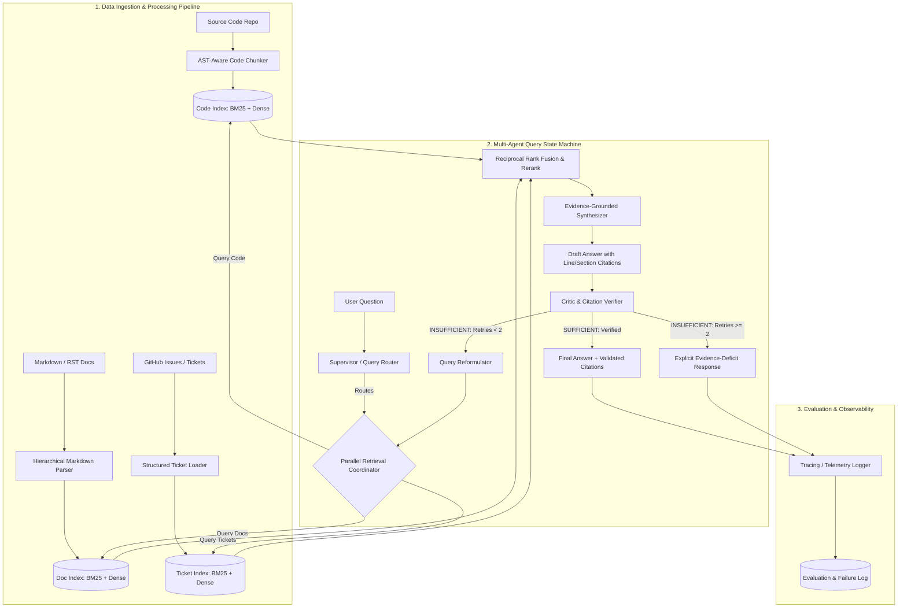

# System Architecture & Technical Design

## 1. High-Level Architecture Overview

The Engineering Knowledge Copilot is structured as an event-driven, multi-agent state graph built on **LangGraph**, operating over distinct vector and sparse index stores with deterministic verification gates.



---

## 2. Core Subsystems & Components

### 2.1 Ingestion & Chunking Layer
1. **Repository Loader & File Filter**:
   - Walks repository, computes SHA-256 hashes per file for incremental diffing.
   - Filters out binary files, `.git/`, virtualenvs (`.venv`, `node_modules`), build artifacts (`dist/`, `build/`), and media files.
2. **AST-Aware Code Chunker (Python `ast` / `tree-sitter`)**:
   - Extracts complete syntactic units: `ClassDef`, `FunctionDef`, `AsyncFunctionDef`.
   - Maintains parent-child context (e.g. `ClassName.method_name`), module-level docstrings, and imports.
   - Preserves exact 1-indexed `start_line` and `end_line`.
3. **Hierarchical Markdown Chunker**:
   - Chunks documentation by Markdown heading boundaries (`#`, `##`, `###`).
   - Tracks heading breadcrumb paths (e.g. `Authentication > Session Management`).
4. **Ticket Normalizer**:
   - Ingests issues/tickets into a structured schema including title, body, status, author, comments, and issue number.

---

### 2.2 Retrieval Engine (Hybrid Dense + Sparse)
For each source domain (Code, Docs, Tickets), retrieval executes two complementary passes:
1. **Dense Vector Retrieval**: Captures semantic similarity (e.g., query: *"where do we handle login credentials"* $\rightarrow$ matches `def authenticate_user(...)`).
2. **Sparse BM25 Retrieval**: Captures exact identifier matches (e.g., query: `HTTP_401_UNAUTHORIZED` or `TokenExpiredException`).
3. **Reciprocal Rank Fusion (RRF)**:
   $$RRF\_Score(d) = \sum_{m \in M} \frac{1}{k + r_m(d)}$$
   where $k=60$, and $r_m(d)$ is the rank of document $d$ in system $m$.
4. **Optional Cross-Encoder Reranker**: Scores the top candidates to prune irrelevant context before synthesis.

---

### 2.3 Agent State Machine (LangGraph Orchestration)

The multi-agent workflow is represented as a state graph with the following shared state:

```python
class AgentState(TypedDict):
    question: str
    original_query: str
    active_query: str
    retry_count: int
    max_retries: int
    target_sources: list[str]  # ["CODE", "DOCS", "TICKETS"]
    complexity: str            # "SINGLE_HOP" | "MULTI_HOP"
    subqueries: list[dict]     # [{"source": "CODE", "query": "..."}]
    retrieved_evidence: list[dict]
    draft_answer: str
    citations: list[dict]
    critic_verdict: str        # "SUFFICIENT" | "INSUFFICIENT" | "REFUSAL"
    unsupported_claims: list[str]
    missing_information: str
    final_response: str
```

#### Node Roles & Contracts:
1. **Supervisor / Router Node**:
   - Analyzes incoming query without attempting to answer it.
   - Classifies required sources: `["CODE"]`, `["DOCS"]`, `["TICKETS"]`, or combinations.
   - Emits decomposed subqueries if the question is multi-hop.
2. **Parallel Retrieval Node**:
   - Executes queries concurrently across the selected domain retrievers using `asyncio.gather` with timeouts.
3. **Evidence Fusion Node**:
   - Deduplicates and normalizes chunks into a unified evidence list with unambiguous IDs.
4. **Synthesis Node**:
   - Injected with strict prompt: *"You are an evidence-grounded engineering auditor. Answer strictly from the provided context. Every factual assertion must be followed by an exact citation `[filepath:start-end]` or `[TICKET-id]`. If evidence is missing, state it explicitly."*
5. **Critic / Verifier Node**:
   - Evaluates the draft answer against the retrieved evidence chunks.
   - Checks:
     a) Citation validity: Do the cited line ranges actually exist in the retrieved context?
     b) Claim support: Is every factual statement backed by evidence?
     c) Hallucination check: Are there entities, methods, or tickets mentioned that do not exist in the context?
   - Outputs: `SUFFICIENT` or `INSUFFICIENT` with specific reasons.
6. **Query Reformulator Node**:
   - If `retry_count < MAX_RETRIES` (2), extracts the `missing_information` diagnosed by the Critic and formulates targeted search terms.

---

## 3. Citation Traceability Schema

Every citation must parse into a strictly typed schema:

```json
{
  "source_type": "CODE",
  "source_path": "src/auth/service.py",
  "line_range": [42, 78],
  "symbol": "AuthService.verify_token",
  "quote_snippet": "if token.is_expired(): raise TokenExpiredException()"
}
```

The system includes a **Deterministic Citation Validator** that runs before showing the output to the user:
- If a cited line range or ticket ID is not present in the retrieved chunks, the citation is flagged as an invalid citation error.

---

## 4. Bounded Retry & Self-Correction Safeguards

To prevent infinite loops, unpredictable costs, and latency spikes:
- `MAX_RETRIES = 2` hardcoded limit.
- If Critic fails on retry #2, the system does not loop again; it transitions to the `GracefulRefusal` node, returning the partial evidence found, what specifically could not be verified, and why it refused to speculate.
